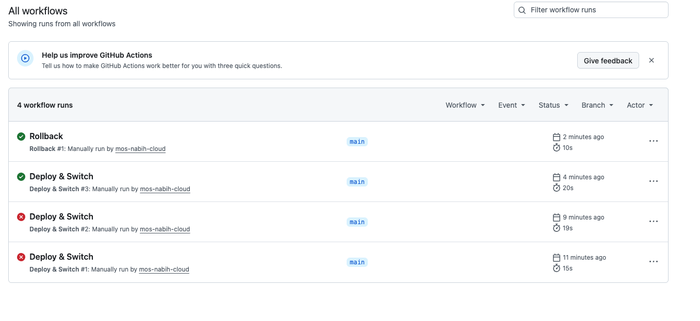
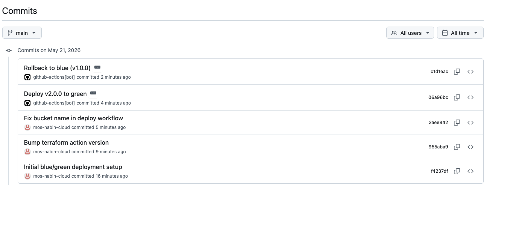
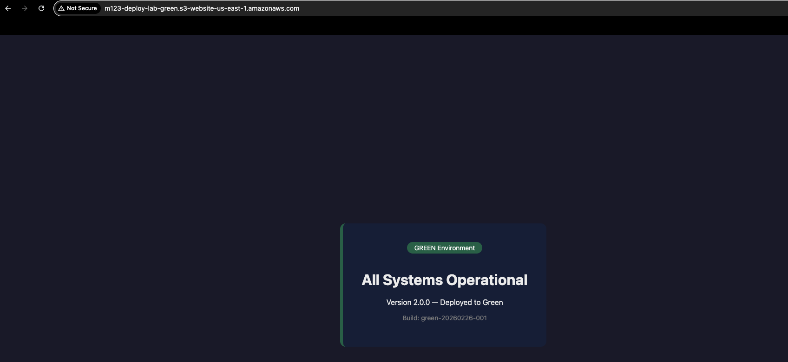
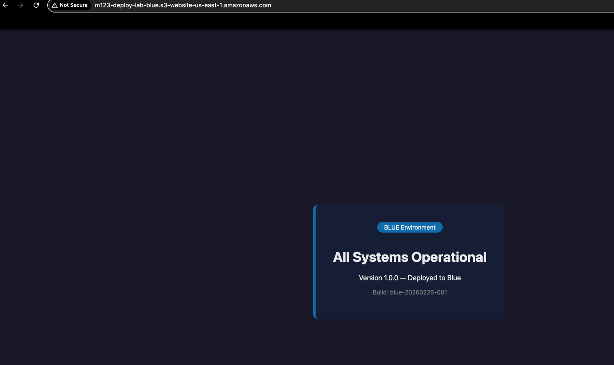

# Lab M5.06 - Deployment Strategies (Blue/Green)

- **Name**: Mos
- **Date**: 21.05.2026
 
## Architecture
 
Two S3 static website buckets serve as deployment targets:
- **Blue** — `deploy-lab-blue.s3-website-us-east-1.amazonaws.com`
- **Green** — `deploy-lab-green.s3-website-us-east-1.amazonaws.com`
 
Only one is "active" at a time, tracked by `deployment.json`.
 
## Workflows
 
### Deploy & Switch (`.github/workflows/deploy.yml`)
1. Reads `deployment.json` to find the inactive environment
2. Deploys new content to the inactive bucket
3. Health-checks the deployment (HTTP 200)
4. Switches `active_environment` in `deployment.json`
5. Commits the updated state
 
### Rollback (`.github/workflows/rollback.yml`)
1. Reads `deployment.json` to find the currently active environment
2. Switches back to the previous environment (no redeployment needed)
3. Records rollback reason in history
4. Commits the updated state
 
## Deployment State (`deployment.json`)
Tracks active environment, version, deployer, timestamp, and full history.
 
## Key Learnings
- Blue/green eliminates downtime during deployments
- The inactive environment is always ready for the next deploy
- Rollback is instant — just switch the pointer
- Deployment history provides an audit trail

## Screenshots

### Workflow and deployment state

### Deployed environments

